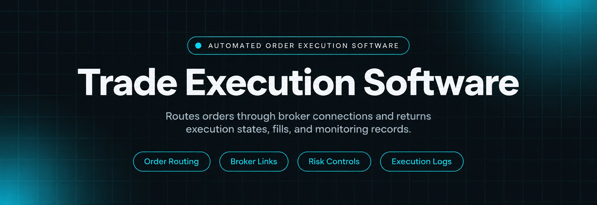
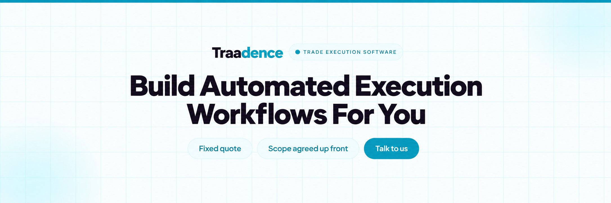
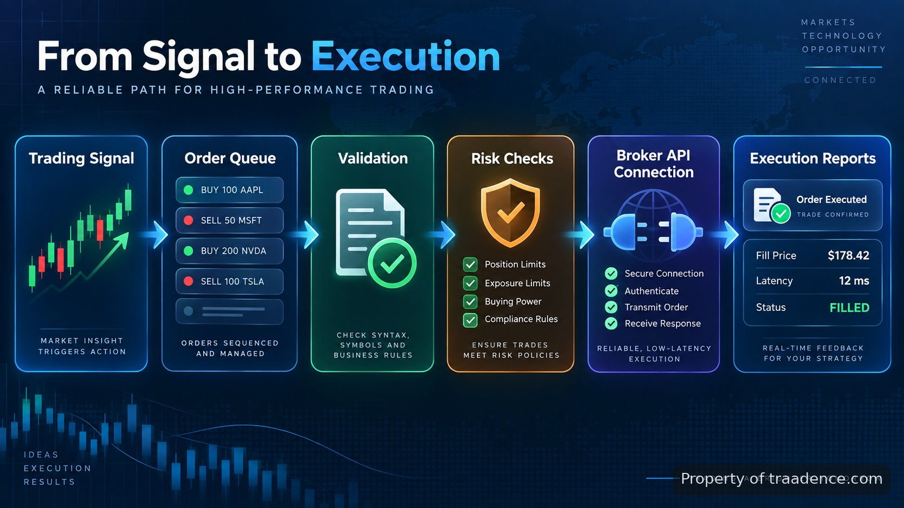

<p align="center">
  <a href="https://www.traadence.com" target="_blank" rel="nofollow">
    
  </a>
</p>

## Traadence's trade execution software

Traadence's trade execution software is a repository example of a system built to manage the path between a trading decision and a completed order. It receives order instructions, validates rules, sends requests through connected providers, and records execution results. The focus is not predicting markets; it is controlling the mechanics around order handling so traders and trading teams can see what happened, when it happened, and why an order reached its final state.

> A trading system is only as reliable as the process that turns an instruction into an executed order.

Trade execution software is used by discretionary traders, automated strategy operators, and firms running multiple accounts that need consistent order handling. A typical manual process requires copying order details, checking account rules, sending orders through a platform, and reviewing fills afterward. An execution layer replaces those disconnected actions with a defined workflow. The system can apply order rules, connect to broker interfaces, measure timing, and preserve execution records for review.

<a href="https://www.traadence.com" target="_blank" rel="nofollow">
  
</a>

<p align="center">
  <a href="https://t.me/Bitbash333" target="_blank" rel="nofollow">
    
  </a>&nbsp;
  <a href="https://wa.me/923249868488?text=Hi%2C%20I%27m%20interested%20in%20Traadence." target="_blank" rel="nofollow">
    
  </a>&nbsp;
  <a href="mailto:hello@traadence.com" target="_blank" rel="nofollow">
    
  </a>&nbsp;
  <a href="https://www.traadence.com" target="_blank" rel="nofollow">
    
  </a>
</p>



## How order routing works in practice

The core problem in order handling is that a trading instruction contains more than a symbol and direction. The system must understand quantity, order type, account rules, timing requirements, and the destination where the order should be sent. A typical workflow begins with an incoming request such as buying 2 contracts of a futures instrument at market, then moves through validation before reaching the execution provider.

The execution pipeline separates each stage so failures can be identified. If an order is rejected, the record shows whether the issue came from validation, connectivity, account restrictions, or the destination venue. This approach follows established trading communication patterns such as the FIX protocol, which defines electronic messaging standards for financial transactions. The <a href="https://www.fixtrading.org/standards/" target="_blank" rel="nofollow">FIX Trading Community documentation</a> describes message structures used across many electronic trading environments.

## Automated order execution for repeatable actions

Manual order entry creates avoidable delays when a strategy produces frequent signals. Automated order execution removes repeated keyboard actions by converting approved instructions into structured orders. The system receives parameters such as instrument, quantity, side, and order type, then applies the configured execution rules before submitting the request.

| Feature | Description |
| --- | --- |
| Order validation layer | Reduces invalid submissions by checking symbols, quantities, order types, and account conditions before sending requests. |
| Broker connection handling | Removes manual platform switching by passing approved orders through configured broker or exchange interfaces. |
| Execution monitoring | Prevents missing order states by tracking submitted, accepted, filled, rejected, and cancelled events. |
| Risk controls | Limits unwanted actions by applying configured boundaries such as maximum position size and order permissions. |
| Execution timing records | Shows the delay between signal receipt, order submission, and final response for review. |

## Broker integration and trading connections

A trading system depends on reliable communication with the destination where orders are executed. Broker integration connects the execution layer with account APIs or platform interfaces while keeping order logic separate from connection details. This makes it possible to update a connection without rewriting the entire workflow.

For example, an adapter can translate an internal order format into the structure required by a broker API. The connection layer manages authentication, requests, responses, and error messages. When working with supported platforms, the implementation follows their documented interfaces, such as the <a href="https://www.interactivebrokers.com/campus/ibkr-api-page/" target="_blank" rel="nofollow">Interactive Brokers API documentation</a> or <a href="https://www.mql5.com/en/docs" target="_blank" rel="nofollow">MetaTrader 5 developer resources</a>.

The repository structure separates strategy logic, execution services, and provider connectors. This prevents a broker-specific change from affecting unrelated parts of the system.

```text
traadence-execution-system/
├── src/
│   ├── execution/
│   │   ├── order_router.py
│   │   ├── validator.py
│   │   └── monitor.py
│   ├── connectors/
│   │   ├── broker_adapter.py
│   │   └── api_client.py
│   └── risk/
│       └── rules.py
├── config/
│   └── settings.yaml
└── tests/
    └── test_orders.py
```

<a href="https://tally.so/r/vG5J40?platform=GitHub&amp;format=Product+repo&amp;brand=Traadence&amp;niche=trading&amp;page=Trade+Execution+Software&amp;date=2026-09-17" target="_blank" rel="nofollow">
  
</a>

## Execution monitoring and records

An order that disappears after submission creates uncertainty. Execution monitoring keeps a timeline of each event so operators can inspect the complete path. The system records timestamps for submission, acknowledgement, fill updates, cancellations, and errors.

A practical example is a market order submitted at 09:30:00.250. The monitoring layer can record when the request entered the system, when the broker accepted it, and when the fill confirmation returned. Measuring these intervals helps identify delays and connectivity issues. Market participants often evaluate execution quality using measures such as transaction costs and execution performance; the <a href="https://www.cmegroup.com/education/articles-and-reports.html" target="_blank" rel="nofollow">CME Group transaction cost analysis resources</a> provide industry context around execution measurement.

## Risk controls before an order is released

Trading automation requires limits before actions reach a market. Risk controls provide checkpoints that can block or modify instructions based on predefined rules. The system can check maximum order quantity, allowed instruments, account permissions, and position exposure before releasing an order.

These controls do not determine whether a trade idea is successful. They control the conditions under which an order is allowed to proceed. A typical rule might reject a request that attempts to open a position above a configured lot size or prevent new entries after a defined daily loss threshold.

## Low latency processing and timing control

When execution timing matters, unnecessary processing steps add delay. Low latency trading systems reduce the time spent moving an order from input to broker response by keeping the execution path focused. This involves efficient message handling, controlled network calls, and lightweight validation before submission.

The system measures timing rather than assuming performance. For example, a log entry can show signal receipt at one timestamp, order submission 8 milliseconds later, and broker acknowledgement after the external response arrives. The <a href="https://www.nasdaq.com/solutions/market-technology" target="_blank" rel="nofollow">Nasdaq market structure resources</a> describe how electronic markets depend on technology, connectivity, and order handling processes.

## Who uses this type of execution system

- Algorithmic traders can send strategy-generated orders through a controlled process instead of manually entering each position.
- Trading teams managing multiple accounts can apply shared execution rules and review order history from one record stream.
- Developers building trading platforms can use the execution layer as a separate component for routing, monitoring, and testing.

The system is also designed for ongoing changes such as adding broker connectors, adjusting validation rules, or extending reporting fields. Traadence works on trading software customization, deployment, and maintenance projects where these execution components need to fit existing environments.

## How to configure using Traadence's trade execution software

- **STEP 1 — Download & Set Up the Project** Traadence's trade execution software is obtained as a repository build and installed with the required environment settings.
- **STEP 2 — Open Execution Settings** Load the configuration file and review broker connections, account mappings, and order permissions before running.
- **STEP 3 — Configure Order Rules** Select execution parameters including symbols, quantities, order types, and risk limits exposed by the system.
- **STEP 4 — Run and Review Output** Submit an order request, then inspect execution records, status changes, and monitoring logs.

## Implementation notes for developers

A practical execution layer should separate incoming signals from broker communication. This repository follows that pattern by keeping order decisions, validation, routing, and reporting as distinct responsibilities. Developers can test each stage independently using simulated order responses before connecting to a live environment.

The system should also preserve audit information. Every request should have an identifier, timestamps, source information, and final status. These records make debugging possible when an order path involves several external systems.

## FAQ

### How does the execution system handle broker connections?

The system uses connector modules that translate internal order requests into the format required by each supported broker interface. Authentication, requests, responses, and errors are handled in the connection layer so execution logic stays separate.

### Can the system monitor orders after they are sent?

Yes. The monitoring layer tracks order states including submission, acceptance, fills, cancellations, and failures. It keeps timestamps and status records so operators can review the complete execution path.

### What risk controls are included in the execution process?

The system can apply configured checks before releasing orders, including quantity limits, allowed instruments, permissions, and exposure rules. These controls define when an order is allowed to proceed.

<table>
  <tr>
    <td align="center" width="33%">
      
      <p>This scraper helped me gather thousands of posts effortlessly. The setup was fast, and exports are super clean and well-structured.</p>
      <p><b>Nathan Pennington</b><br>Marketer<br>★★★★★</p>
    </td>
    <td align="center" width="33%">
      
      <p>What impressed me most was how accurate the extracted data is. Likes, comments, timestamps — everything aligns perfectly.</p>
      <p><b>Greg Jeffries</b><br>SEO Affiliate Expert<br>★★★★★</p>
    </td>
    <td align="center" width="33%">
      
      <p>It's by far the best tool I've used. Ideal for trend tracking, competitor monitoring, and influencer insights.</p>
      <p><b>Karan</b><br>Digital Strategist<br>★★★★★</p>
    </td>
  </tr>
</table>